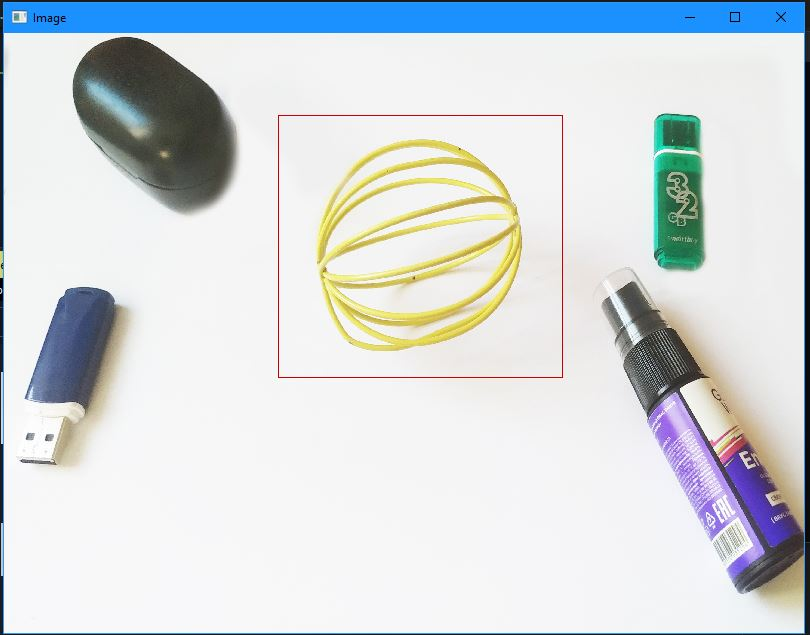

# Лабораторная работа №2

---

## **Цель работы:**

Провести исследование основных алгоритмов обнаружения объектов на изображениях.

**Задание:**

1. Создать программу в соответствии с поставленной задачей, реализуя базовый алгоритм в трех вариантах: с использованием встроенных функций из библиотеки (например, OpenCV, PIL), на чистом Python и с применением Numba или C++.
2. Произвести сравнительный анализ производительности каждой реализации.
3. Составить отчет в формате README на GitHub, включающий исходный код программы.

## Теоретическая база

---

В компьютерном зрении распознавание конкретных объектов является частой задачей. На данный момент для решения таких задач наиболее распространены нейронные сети и глубокое обучение, чаще всего сверточные нейронные сети. Однако для простых задач можно успешно использовать классические математические алгоритмы, такие как поиск шаблона (template matching), который заключается в поиске одного изображения (темплата) на другом, и поиск особенностей (feature matching), который основывается на поиске ключевых точек. Далее мы рассмотрим эти алгоритмы более подробно:

##### Template matching

Этот метод используется для обнаружения участков на изображении, которые максимально похожи на определенный шаблон. Для этого метода входными параметрами являются:

- изображение, на котором будет производиться поиск шаблона;

- изображение объекта, который мы пытаемся найти на тестируемой картинке; при этом размер шаблона должен быть меньше размера проверяемого изображения

Алгоритм нацелен на поиск области в тестируемой картинке, которая наилучшим образом соответствует заданному шаблону. Для этого шаблон последовательно перемещается на один пиксель по всей тестируемой картинке, и каждая новая область оценивается на схожесть с шаблоном. Область с наивысшим коэффициентом совпадения выбирается как результат. Этот метод, называемый "шаблонным сопоставлением", удобен для быстрой проверки наличия объекта на изображении без необходимости использовать обучаемые алгоритмы. Различные критерии совпадения могут быть использованы, включая те, которые предоставляются библиотекой [OpenCV](https://docs.opencv.org/3.4/df/dfb/group__imgproc__object.html#ga3a7850640f1fe1f58fe91a2d7583695d)

**Пример:**

Найдём вот такой объект

Рис.1 - Искомый объект

Для упрощения принято обесцвечивать (Ч/Б)

Рис.2 - Результат обнаружения искомого изображения

Результатом сравнения темплата и исходного изображения является изображение справа. На этом изображении светлая точка обозначает максимальное значение и предположительно указывает на центр искомого объекта. Однако необходимо понимать, что при использовании метода "шаблонного сопоставления" нельзя с уверенностью утверждать, был ли найден искомый объект, поскольку это вероятностная характеристика, которая может зависеть от масштаба, углов обзора, поворотов изображения и физических помех.

##### **Feature Detection**

**Feature detection** - это концепция в области компьютерного зрения, которая направлена на вычисление абстракций изображения и выделение на нем ключевых особенностей. Эти особенности затем используются для сравнения двух изображений с целью определения общих элементов. Не существует строгого определения ключевых особенностей изображения. Это могут быть как изолированные точки, так и кривые или связанные области. Примерами таких особенностей могут служить грани объектов и углы.

Рис.3 - Пример определения ключевых точек изображения

[Сравнение префильтров в обнаружении объектов на основе ORB](https://www.sciencedirect.com/science/article/abs/pii/S0167865516303300)

## 

## Описание проекта

---

В проекте расположен каталог media - для хранения датасета объектов, а также два файла - **main.py** основная работа программы и вызовы функций определения объекта и **my_functions.py** - описания всех рассчётных и определяющих искомый объект функций.

Внутри главное программы происходит следующее:

1. Мы считываем изображения (оригинальное с множеством объектов) и выбранное изображение искомого объекта (в процессе можно менять).

2. Конвертируем оба изображения в ЧБ

3. Масштабируем изображения для сохранения одного и того же размера

4. Применяем алгоритм поиска объекта по желанию -  Template matching или Feature detection

Файл описывающий функции содержит следующее:

- **template_matching_my** - функция реализации детектирования без встроенной функции OpenCV, на основе SQDIFF

- **template_matching_ocv** - функция реализации детектирования средствами OpenCV

- **feature_matching_sift** - функция реализации детектирования feature-matching SIFT

- **getImageSize** - вспомогательная функция для печати в консоль размеров изображения типа cv2

- **template_matching_my_calculate** - вспомогательная функция для получения координат точек минимума

## Результаты работы и тестирования системы

---

Рис.4 - Фотография множества объектов

Рис.5 - Искомый объект

Рис.6 - Результат работы программы (нахождение объекта из множества)

На основе 10 изображений проверяется возможность точного определения объекта при изменении освещения, ракурса и других факторов. Приведу показатели эффективности успешного определения, используя Template Matching opencv и Feature Matching SIFT:

- Template Matching OCV: уд. определено - 7 / неуд. определено - 3;

- Feature Matching SIFT: уд. определено - 9 / неуд. определено - 1;

Более подробно:

|                                                | Template Matching OCV | Feature Matching SIFT |
| ---------------------------------------------- |:---------------------:|:---------------------:|
| Оригинальный фрагмент                          | 100% (+)              | 95% (+)               |
| Оригинальный фрагмент (поворот на 90 градусов) | 0% (-)                | 90% (+)               |
| Фрагмент с тенью                               | 97% (+)               | 98% (+)               |
| Фрагмент при тёмном освещении                  | 1% (-)                | 95% (+)               |
| Увеличенный фрагмент                           | 99% (+)               | 95% (+)               |
| Другой ракурс фрагмента 1                      | 99% (+)               | 97% (+)               |
| Другой ракурс фрагмента 2                      | 97% (+)               | 3% (-)                |
| Фрагмент при ярком освещении                   | 0% (-)                | 97% (+)               |
| Фрагмент с низким качеством чёткости           | 98% (+)               | 95% (+)               |
| Другой ракурс фрагмента 3                      | 98% (+)               | 80% (+)               |

---

## Выводы по работе

---

Была проведена работа по исследованию методов поиска изображений с применением таких детекторов объектов, как Template Matching и Feature Matching с использованием алгоритма SIFT. Оба метода справляись с определением объекта довольно неплохо, но следуя по проведённому исследованию я заметил, что Template Matching не справился с обнаружением объекта при более ярком или тёмном освещении, в отличии от Feature Matching. Также Template Matching не смог определить объект по перевёрнотому шаблону.

Исходя из исследования я пришёл к тому, что Template Matching использовать можно и его результаты не плохие, но если речь о разной освещённости или при повёрнутом искомом объекте, лучше использовать Feature Matching.

## Список web-источников

---

[OpenCV: Template Matching](https://docs.opencv.org/3.4/d4/dc6/tutorial_py_template_matching.html)

[Ареал | Анализ алгоритмов компьютерного зрения](https://blog.arealidea.ru/articles/mobile/analiz-algoritmov-kompyuternogo-zreniya-poiska-obektov-i-sravneniya-izobrazheniy/)

[OpenCV: Object Detection](https://docs.opencv.org/3.4/df/dfb/group__imgproc__object.html#ga3a7850640f1fe1f58fe91a2d7583695d)

[A comparison of prefilters in ORB-based object detection - ScienceDirect](https://www.sciencedirect.com/science/article/abs/pii/S0167865516303300)
